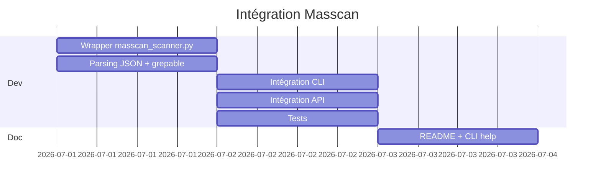

# RFC-001: Intégration Masscan — Scanner de ports ultra-rapide

| Métadata |||
|---------|---------|---------|
| **Auteur** | INNOVATOR Agent | **Date** | 2026-06-26 |
| **Statut** | 🟢 Proposé | **Priorité** | P1 |
| **Version cible** | v0.7.0 | **Module** | `scanner/` |

---

## 1. Résumé Exécutif

Ajouter un wrapper **masscan** au module `scanner/` pour permettre des scans de ports **asynchrones massifs** (jusqu'à 1 Mpps). Masscan complète nmap : nmap pour la précision (banner grabbing, fingerprinting OS), masscan pour la **vitesse** (scan de /8 en quelques minutes).

---

## 2. Analyse de l'existant

### Ce qui existe dans `scanner/` :
| Fichier | Fonction |
|---------|----------|
| `nmap_scanner.py` | Wrapper async nmap (TCP Connect, UDP, banner grabbing) |
| `tcp.py` | TCP Connect Scan natif (sans nmap) |
| `engine.py` | Orchestrateur parse_ports, run_scan, run_scan_background |
| `contextual.py` | Scan adaptatif par service détecté |
| `fingerprint.py` | Détection OS et service (TTL, flags TCP) |
| `vuln_db.py` | 17 signatures CVE |
| `nuclei_scanner.py` | Scanner de vulnérabilités 10k+ templates |

### Constats :
- Le scanner TCP natif (`tcp.py`) est limité à ~200 connexions simultanées
- Nmap est lent sur de larges plages (ex: 0.0.0.0/8)
- **Aucun outil de scan massif n'existe actuellement**
- Le CLI expose `navmax scan <target>` mais sans option `--masscan`

---

## 3. Proposition Technique

### 3.1 Nouveau fichier : `navmax/scanner/masscan_scanner.py`

Wrapper autour du binaire masscan, suivant le même pattern que `nmap_scanner.py` :

```python
class MasscanScanner:
    """Wrapper asynchrone pour masscan — scan de ports ultra-rapide."""

    def __init__(self, rate: int = 10000):
        self._binary = self._find_binary()
        self.rate = rate

    async def scan(
        self,
        targets: str | list[str],       # "10.0.0.0/8" ou ["192.168.1.1", "10.0.0.1"]
        ports: str = "1-65535",          # "80,443,8000-9000"
        rate: int | None = None,        # paquets/sec (défaut: 10000)
        output_format: str = "json",    # json | xml | grepable
        exclude: str | None = None,     # plages à exclure
        adapt_rate: bool = True,        # auto-réduction si perte > 10%
    ) -> MasscanResult:
        ...
```

### 3.2 Classes de données

```python
@dataclass
class MasscanPort:
    port: int
    protocol: str       # "tcp" | "udp"
    state: str          # "open" | "filtered"
    reason: str         # "syn-ack" | "rst"

@dataclass
class MasscanResult:
    targets: str
    ports: str
    total_hosts: int
    total_open: int
    duration_seconds: float
    open_ports: list[MasscanPort]
    rate: int
    raw_output: str
```

### 3.3 Intégration dans l'existant

**`navmax/scanner/engine.py`** :
```python
from .masscan_scanner import MasscanScanner

async def run_masscan_scan(targets, ports="1-65535", rate=10000):
    scanner = MasscanScanner(rate=rate)
    return await scanner.scan(targets, ports)
```

**`navmax/scanner/__init__.py`** :
```python
from .masscan_scanner import MasscanResult, MasscanScanner
```

### 3.4 CLI

```python
# navmax/cli.py
@app.command()
def masscan(
    target: str = typer.Argument(..., help="CIDR ou IP"),
    ports: str = typer.Option("1-65535", "--ports", "-p"),
    rate: int = typer.Option(10000, "--rate", "-r", help="Paquets/seconde"),
):
    """Scan de ports ultra-rapide avec masscan."""
```

### 3.5 API

```python
# navmax/api/routes/scans.py
@router.post("/masscan", response_model=MasscanResponse)
async def masscan_scan(req: MasscanRequest):
    """Lance un scan masscan en arrière-plan."""
```

---

## 4. Dépendances

| Dépendance | Type | Version |
|------------|------|---------|
| `masscan` | Binaire externe | ≥ 1.0.5 (`apt install masscan` / `choco install masscan`) |
| Aucune dépendance Python | — | Utilise `subprocess` (comme nmap_scanner) |

---

## 5. Tests

**Nouveau fichier :** `tests/test_masscan_scanner.py`

| Test | Type | Description |
|------|------|-------------|
| `test_masscan_binary_found` | Unitaire | Vérifie la détection du binaire |
| `test_masscan_parse_json_output` | Unitaire | Parse la sortie JSON type |
| `test_masscan_parse_grepable` | Unitaire | Parse la sortie grepable |
| `test_masscan_rate_validation` | Unitaire | Vérifie rate min/max |
| `test_masscan_exclude_filter` | Unitaire | Vérifie --exclude |
| `test_masscan_scan_localhost` | Intégration | Scan localhost sur 1-1024 (si masscan installé) |

---

## 6. Matrice Impact / Effort

| Critère | Score | Détail |
|---------|-------|--------|
| **Impact technique** | 9/10 | Scan de /8 en minutes vs heures avec nmap |
| **Impact utilisateur** | 8/10 | Nouvelle capacité majeure : reconnaissance externe massive |
| **Impact roadmap** | 9/10 | Complète nmap, débloque les scans à grande échelle |
| **Effort estimé** | 3/10 | ~1 journée (pattern existant, wrapper simple) |
| **Risque** | 2/10 | Binaire externe optionnel, fallback sur nmap si absent |
| **Priorité finale** | **P1** | Fort impact, faible effort |

### Estimation :
- Code : ~200 lignes (wrapper + parsing JSON)
- Tests : ~150 lignes
- Documentation : ~50 lignes
- **Total : ~1-2 jours de dev**

---

## 7. Roadmap d'intégration



---

## 8. Alternatives Considérées

| Alternative | Raison du rejet |
|-------------|-----------------|
| **ThreadPool** dans `tcp.py` | Ne peut pas dépasser ~1000 ports/s, pas scalable |
| **Zmap** | Moins flexible que masscan (TCP uniquement, ports limités) |
| **Rustscan** | Dépendance Rust, moins mature |
| **Naabu** | ProjetDiscovery, bons résultats mais masscan plus standard |
