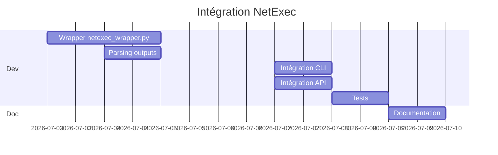

# RFC-002: Intégration NetExec (nxc) — Successeur de CrackMapExec

| Métadata |||
|---------|---------|---------|
| **Auteur** | INNOVATOR Agent | **Date** | 2026-06-26 |
| **Statut** | 🟢 Proposé | **Priorité** | P2 |
| **Version cible** | v0.7.0 | **Module** | `ad/` |

---

## 1. Résumé Exécutif

Intégrer **NetExec** (ex-CrackMapExec, `nxc`) comme wrapper dans le module `ad/`. NetExec est l'outil de référence pour l'exploitation multi-protocole des environnements Windows/Active Directory : SMB, LDAP, WinRM, MSSQL, SSH, RDP, FTP. Il permet l'exécution de commandes, le dump de hashes, le pass-the-hash, et la recherche de vulnérabilités comme ZeroLogon, PrintNightmare, etc.

---

## 2. Analyse de l'existant

### Ce qui existe dans `ad/` :
| Fichier | Fonction |
|---------|----------|
| `connector.py` | Connexion LDAP SSL/TLS, binding, recherche |
| `enumerator.py` | Users, groups, computers, OUs, GPOs, trusts |
| `trust_graph.py` | NetworkX multi-domaine, chemins d'attaque |
| `attack_paths.py` | Analyse des chemins critiques |
| `vuln_scanner.py` | Kerberoasting, AS-REP, Delegation, Privileged |
| `password_spray.py` | Smart spray + lockout protection |
| `smb_scanner.py` | SMB shares, null sessions |
| `adcs_scanner.py` | ESC1-9, templates, CAs |
| `bloodhound_export.py` | JSON BloodHound CE |
| `responder_wrapper.py` | NTLM hash capture |
| `certipy_wrapper.py` | Certipy pour ADCS |

### Constats :
- AD possède déjà la **phase reconnaissance** (enum, vuln scan, spray)
- Mais il manque la **phase exploitation / post-exploitation** sur SMB, WinRM, LDAP
- Pas d'exécution de commandes à distance via SMB/WinRM
- Pas de pass-the-hash automatisé
- Pas de vérification ZeroLogon/PrintNightmare
- NetExec est le standard industriel (remplace CME) mais absent de NavMAX

---

## 3. Proposition Technique

### 3.1 Nouveau fichier : `navmax/ad/netexec_wrapper.py`

Wrapper autour du binaire `netexec` (ou `nxc`), avec une API Pythonique :

```python
class NetExecProtocol(Enum):
    """Protocoles supportés par NetExec."""
    SMB = "smb"
    WINRM = "winrm"
    LDAP = "ldap"
    MSSQL = "mssql"
    SSH = "ssh"
    RDP = "rdp"
    FTP = "ftp"


@dataclass
class NetExecTarget:
    host: str
    protocol: NetExecProtocol
    port: int | None = None
    timeout: int = 10


@dataclass
class NetExecCredential:
    username: str
    password: str | None = None
    nt_hash: str | None = None      # Pass-the-Hash
    lm_hash: str | None = None
    kerberos: bool = False
    domain: str | None = None


@dataclass
class NetExecResult:
    protocol: str
    host: str
    status: str                     # "Pwn3d!" | "Plaintext" | "FAIL"
    credential: NetExecCredential | None = None
    output: str = ""
    shares: list[str] = None
    users: list[str] = None
    groups: list[str] = None
    vulnerabilities: list[str] = None
    executed_commands: list[str] = None


class NetExecWrapper:
    """Wrapper Python pour NetExec (CrackMapExec v3)."""

    def __init__(self, binary: str | None = None):
        self._binary = binary or self._find_binary()

    async def smb_enum(
        self,
        targets: list[NetExecTarget],
        creds: NetExecCredential,
        shares: bool = True,
        users: bool = True,
        spider: str | None = None,          # dossier à spider (ex: "Users$")
        get_hashes: bool = False,           # SAM dump (admin requis)
        modules: list[str] = None,          # modules nxc à charger
    ) -> list[NetExecResult]:
        ...

    async def winrm_exec(
        self,
        target: NetExecTarget,
        creds: NetExecCredential,
        command: str,
    ) -> NetExecResult:
        ...

    async def ldap_enum(
        self,
        target: NetExecTarget,
        creds: NetExecCredential,
        query: str | None = None,          # filtre LDAP personnalisé
        asrep: bool = False,                # AS-REP roasting
        kerberoast: bool = False,           # Kerberoasting
        delegated: bool = False,            # délégations non sécurisées
        admin_count: bool = False,          # utilisateurs adminCount=1
    ) -> NetExecResult:
        ...

    async def check_vulnerability(
        self,
        target: NetExecTarget,
        vuln: str,                          # "zerologon" | "petitpotam" | "nopac" | "ms17-010"
    ) -> NetExecResult:
        ...

    async def pass_the_hash(
        self,
        target: NetExecTarget,
        nt_hash: str,
        username: str,
        domain: str,
        command: str | None = None,
    ) -> NetExecResult:
        """Pass-the-Hash : exécution de commande via SMB/WinRM avec hash NT."""
        ...
```

### 3.2 Modules NetExec prévus

| Module | Fonction |
|--------|----------|
| `smb/shares` | Énumération des partages SMB |
| `smb/spider` | Spider récursif d'un partage |
| `smb/sam` | Dump SAM (admin requis) |
| `smb/zero_logon` | Test CVE-2020-1472 |
| `smb/printnightmare` | Test CVE-2021-1675 / CVE-2021-34527 |
| `smb/petitpotam` | Test CVE-2021-36942 |
| `smb/noPAC` | Test CVE-2021-42287 / CVE-2021-42278 |
| `smb/ms17-010` | EternalBlue checker |
| `smb/webexec` | Exécution via WebExec |
| `ldap/kerberoast` | Kerberoasting avancé |
| `ldap/asrep` | AS-REP roasting avancé |
| `ldap/admin_count` | Comptes adminCount=1 |
| `ldap/decrypt_pwd` | GMSA password décryptage |
| `winrm/exec` | Exécution de commande |
| `rdp/check` | Vérification accès RDP |

### 3.3 Intégration CLI

```python
# navmax/cli.py
@app.command()
def netexec(
    action: str = typer.Argument(...),  # smb | ldap | winrm | pth | vuln
    target: str = typer.Option(...),
    username: str = typer.Option(...),
    password: str = typer.Option(None),
    hash: str = typer.Option(None, "--hash", "-H"),
    domain: str = typer.Option(None, "--domain", "-d"),
    module: str = typer.Option(None, "--module", "-m"),
    command: str = typer.Option(None, "--command", "-c"),
):
    """NetExec — exploitation multi-protocole AD (v0.7.0)."""
```

### 3.4 Intégration API

```python
# navmax/api/routes/ad.py
@router.post("/netexec/smb", response_model=NetExecSMBResponse)
async def netexec_smb(req: NetExecSMBRequest):
    """Énumération SMB via NetExec."""

@router.post("/netexec/ldap", response_model=NetExecLDAPResponse)
async def netexec_ldap(req: NetExecLDAPRequest):
    """Énumération LDAP avancée via NetExec."""

@router.post("/netexec/winrm", response_model=NetExecWinRMResponse)
async def netexec_winrm(req: NetExecWinRMRequest):
    """Exécution de commande via WinRM."""

@router.post("/netexec/vuln", response_model=NetExecVulnResponse)
async def netexec_vuln(req: NetExecVulnRequest):
    """Vérification de vulnérabilités (ZeroLogon, PrintNightmare, etc.)."""

@router.post("/netexec/pth", response_model=NetExecPTHResponse)
async def netexec_pth(req: NetExecPTHRequest):
    """Pass-the-Hash."""

@router.get("/netexec/modules", response_model=NetExecModulesResponse)
async def netexec_modules():
    """Liste les modules NetExec disponibles."""
```

---

## 4. Dépendances

| Dépendance | Type | Version | Install |
|------------|------|---------|---------|
| `netexec` | Binaire externe | ≥ 3.0 | `pipx install netexec` |
| `impacket` | Python | ≥ 0.12.0 | ✅ Déjà présent |

---

## 5. Tests

**Nouveau fichier :** `tests/test_netexec_wrapper.py`

| Test | Type | Description |
|------|------|-------------|
| `test_netexec_binary_found` | Unitaire | Détection binaire nxc |
| `test_netexec_parse_smb_enum` | Unitaire | Parse sortie SMB type |
| `test_netexec_parse_ldap_enum` | Unitaire | Parse sortie LDAP type |
| `test_netexec_parse_pwned` | Unitaire | Détection statut "Pwn3d!" |
| `test_netexec_parse_vulnerabilities` | Unitaire | Parse sortie modules vuln |
| `test_netexec_credential_build` | Unitaire | Construction arguments auth |
| `test_netexec_smb_local` | Intégration | Test SMB sur localhost (si SAMBA) |

---

## 6. Matrice Impact / Effort

| Critère | Score | Détail |
|---------|-------|--------|
| **Impact technique** | 9/10 | Exploitation AD complète : SMB, WinRM, LDAP, PTH |
| **Impact utilisateur** | 9/10 | Standard industriel, utilisateurs pentest l'attendent |
| **Impact roadmap** | 8/10 | Comble le fossé recon → exploitation dans AD |
| **Effort estimé** | 5/10 | ~4 jours (wrapper riche, parsing multi-format, API) |
| **Risque** | 3/10 | Dépendance binaire externe, fallback sur impacket pur |
| **Priorité finale** | **P2** | Très fort impact, effort modéré |

### Estimation :
- Wrapper : ~400 lignes
- Parsing : ~200 lignes
- CLI : ~150 lignes
- API : ~300 lignes
- Tests : ~300 lignes
- **Total : ~3-4 jours de dev**

---

## 7. Roadmap d'intégration



---

## 8. Cas d'Usage

### 8.1 SMB Enum + Pass-the-Hash
```bash
navmax netexec smb 192.168.1.0/24 -u admin -H aad3b435b51404eeaad3b435b51404ee
# → [SMB] 192.168.1.10:445 Pwn3d! (admin) - SAM Dumped
# → [SMB] 192.168.1.20:445 Pwn3d! (admin) - Shares: ADMIN$, C$, IPC$
```

### 8.2 Vérification ZeroLogon
```bash
navmax netexec vuln 192.168.1.10 --check zerologon
# → [VULN] 192.168.1.10 zerologon: True (CVE-2020-1472)
```

### 8.3 Kerberoasting via LDAP
```bash
navmax netexec ldap dc01.corp.local -u user -p pass --kerberoast
# → [LDAP] 3 hashes kerberoastables récupérés
```

---

## 9. Alternatives Considérées

| Alternative | Raison du rejet |
|-------------|-----------------|
| **Wrapper impacket pur** | Déjà partiellement fait, mais nxc offre 200+ modules prêts |
| **Script maison SMB+WinRM** | Réinventer la roue, nxc est le standard de facto |
| **Ne pas intégrer** | Grosse lacune : les pentesters utilisent nxc quotidiennement |
