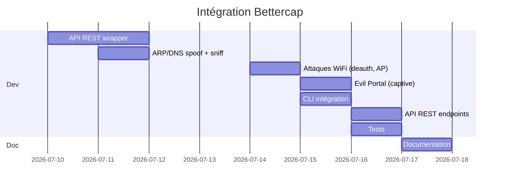

# RFC-003: Intégration Bettercap — MITM WiFi & Réseau complet

| Métadata |||
|---------|---------|---------|
| **Auteur** | INNOVATOR Agent | **Date** | 2026-06-26 |
| **Statut** | 🟢 Proposé | **Priorité** | P3 |
| **Version cible** | v0.7.0 | **Module** | `wireless/` |

---

## 1. Résumé Exécutif

Ajouter un wrapper **bettercap** au module `wireless/` pour offrir des capacités **MITM WiFi complètes** : désauthentification client, capture de handshake WPA2, ARP spoofing, DNS spoofing, HTTPS downgrade, capture de credentials, beacon flooding, et Evil Portal (captive portal). Bettercap est le couteau suisse du MITM réseau, et son intégration complète les capacités WiFi de NavMAX.

---

## 2. Analyse de l'existant

### Ce qui existe dans `wireless/` :
| Fichier | Fonction |
|---------|----------|
| `base.py` | Classes abstraites : BaseWirelessScanner, WiFiNetwork, Handshake, BLEDevice |
| `wifi_scanner.py` | WiFiScanner : scan airodump-ng, déauth aireplay-ng, handshake capture, PMKID |
| `ble_scanner.py` | BLEScanner : scan BLE via bleak, caractéristiques |

### Ce qui existe dans `proxy/` (MITM partiel) :
| Fichier | Fonction |
|---------|----------|
| `mitm.py` | Proxy MITM HTTP/HTTPS via mitmproxy (niveau application) |
| `proxy_server.py` | Serveur proxy HTTP |
| `interceptor.py` | Interception de flux HTTP |
| `certs.py` | Génération de certificats TLS |

### Constats :
- Le module `wireless/` ne gère que le **scan WiFi passif** et la capture de handshake
- **Aucun MITM au niveau réseau** (ARP spoofing, DNS spoofing)
- **Aucune attaque WiFi active** (beacon flood, Evil Twin, Evil Portal)
- Le proxy MITM (`proxy/`) fonctionne au niveau **application** (HTTP/HTTPS), pas réseau
- Bettercap est le standard pour le MITM WiFi mais totalement absent

---

## 3. Proposition Technique

### 3.1 Nouveau module : `navmax/wireless/bettercap_wrapper.py`

Wrapper autour du binaire bettercap via son **API REST** (meilleure approche que subprocess, car bettercap expose une API JSON complète) :

```python
class BettercapModule(Enum):
    """Modules bettercap disponibles."""
    ARP_SPOOFER = "arp.spoof"
    DNS_SPOOFER = "dns.spoof"
    NET_SNIFFER = "net.sniff"
    HTTP_PROXY = "http.proxy"
    HTTPS_PROXY = "https.proxy"
    WIFI_AP = "wifi.ap"
    WIFI_DEAUTH = "wifi.deauth"
    BLE = "ble"
    TICKETBLASTER = "ticketblaster"   # Kerberos ticket extraction


@dataclass
class BettercapSession:
    """Session bettercap active."""
    id: str
    started_at: datetime
    modules_active: list[BettercapModule]
    interface: str
    gateway_ip: str
    target_ip: str | None = None
    # Statistiques en temps réel
    packets_captured: int = 0
    credentials_captured: list[Credential] = None
    handshakes_captured: list[Handshake] = None


@dataclass
class Credential:
    """Credential capturé via bettercap."""
    protocol: str        # "HTTP", "FTP", "SMTP", "IMAP", etc.
    source: str          # IP source
    destination: str     # IP destination
    username: str
    password: str
    url: str | None = None
    timestamp: datetime


class BettercapWrapper:
    """Wrapper pour bettercap via son API REST."""

    def __init__(self, api_host: str = "127.0.0.1", api_port: int = 8081):
        self._api_base = f"http://{api_host}:{api_port}/api"
        self._session = None

    # ── Gestion du cycle de vie ──────────────────────────────────

    async def start(self, interface: str, headless: bool = True) -> BettercapSession:
        """Démarre bettercap en mode headless avec API REST."""
        ...

    async def stop(self):
        """Arrête bettercap proprement."""
        ...

    # ── Attaques MITM réseau ─────────────────────────────────────

    async def arp_spoof(
        self,
        target_ip: str,
        gateway_ip: str,
        full_duplex: bool = True,
    ) -> bool:
        """ARP spoofing entre une cible et la passerelle."""
        ...

    async def dns_spoof(
        self,
        hosts: dict[str, str],         # {"*.target.com": "192.168.1.100"}
    ) -> bool:
        """DNS spoofing : redirige des domaines vers une IP."""
        ...

    async def net_sniff(
        self,
        protocols: list[str] = None,    # "HTTP", "FTP", "TELNET", etc.
        output_file: str | None = None,
        credential_capture: bool = True,
        pcap_output: bool = True,
    ) -> dict:
        """Sniffing réseau avec capture de credentials."""
        ...

    async def http_proxy(
        self,
        port: int = 8080,
        ssl_strip: bool = True,         # HTTPS → HTTP downgrade
        inject_script: str | None = None, # JS injection dans les pages
    ) -> bool:
        """Proxy HTTP mitmproxy-style avec SSL stripping."""
        ...

    # ── Attaques WiFi ────────────────────────────────────────────

    async def wifi_deauth(
        self,
        target_bssid: str | None = None,   # None = broadcast deauth
        channel: int | None = None,
        count: int = 0,                     # 0 = infini
    ) -> int:
        """Désauthentification WiFi (client ou broadcast)."""
        ...

    async def wifi_ap(
        self,
        ssid: str,
        bssid: str | None = None,
        channel: int = 6,
        auth: str = "wpa2",                # "open", "wpa2", "wpa3"
        password: str | None = None,
        hidden: bool = False,
        eviltwin: bool = False,            # Clone d'un AP existant
    ) -> bool:
        """Crée un point d'accès WiFi (Evil Twin possible)."""
        ...

    async def wifi_beacon_flood(
        self,
        ssids: list[str] | None = None,   # None = génération auto
        channel: int = 6,
        rate: int = 10,                   # beacons/sec
    ) -> bool:
        """Inonde la zone de beacons WiFi (confusion clients)."""
        ...

    async def wifi_captive_portal(
        self,
        ssid: str,
        html_template: str | None = None,  # Template de page de login
        redirect_url: str | None = None,    # URL après login
        credential_regex: str | None = None,# Regex extraction credentials
    ) -> bool:
        """Evil Portal : captive portal WiFi pour capture credentials."""
        ...

    # ── Utilitaires ──────────────────────────────────────────────

    async def get_events(
        self,
        since: datetime | None = None,
        types: list[str] | None = None,
    ) -> list[dict]:
        """Récupère les événements bettercap."""
        ...

    async def get_stats(self) -> dict:
        """Statistiques temps réel (paquets, credentials, etc.)."""
        ...

    async def run_command(self, command: str) -> dict:
        """Exécute une commande bettercap arbitraire."""
        ...
```

### 3.2 Script bettercap lancé automatiquement

```python
# navmax/wireless/bettercap_runner.py
BETTERCAP_SCRIPT = """
# Démarrer l'API REST
set api.rest.username admin
set api.rest.password {password}
set api.rest.port 8081
api.rest on

# Activer les logs
set events.stream.output /tmp/bettercap_events.json
events.stream on
"""
```

### 3.3 Intégration dans le CLI

```python
# navmax/cli.py
@app.group()
def wifi():
    """Attaques WiFi & MITM via bettercap."""

@wifi.command()
def mitm(target: str, gateway: str, sniff: bool = True):
    """MITM complet : ARP spoof + sniff + HTTP proxy."""

@wifi.command()
def deauth(target: str = None, channel: int = None):
    """Désauthentification WiFi."""

@wifi.command()
def evil_twin(ssid: str, interface: str):
    """Evil Twin AP + captive portal."""

@wifi.command()
def beacon_flood(ssids: list[str] = None, rate: int = 10):
    """Beacon flood WiFi."""

@wifi.command()
def portal(ssid: str, template: str = None):
    """Captive portal WiFi."""
```

### 3.4 Intégration API

```python
# navmax/api/routes/wireless.py (NOUVEAU)
router = APIRouter(prefix="/api/v1/wireless", tags=["Wireless"])

@router.post("/bettercap/start", response_model=BettercapStartResponse)
async def bettercap_start(req: BettercapStartRequest):
    """Démarre bettercap avec l'interface spécifiée."""

@router.post("/bettercap/stop", response_model=BettercapStopResponse)
async def bettercap_stop():
    """Arrête bettercap."""

@router.post("/bettercap/arp-spoof", response_model=BettercapActionResponse)
async def bettercap_arp_spoof(req: ARPSpoofRequest):
    """Lance ARP spoofing."""

@router.post("/bettercap/dns-spoof", response_model=BettercapActionResponse)
async def bettercap_dns_spoof(req: DNSSpoofRequest):
    """Lance DNS spoofing."""

@router.post("/bettercap/wifi/deauth", response_model=DeauthResponse)
async def bettercap_deauth(req: DeauthRequest):
    """Désauthentification WiFi."""

@router.post("/bettercap/wifi/eviltwin", response_model=EvilTwinResponse)
async def bettercap_eviltwin(req: EvilTwinRequest):
    """Lance un Evil Twin AP."""

@router.post("/bettercap/wifi/portal", response_model=PortalResponse)
async def bettercap_portal(req: PortalRequest):
    """Lance un Evil Portal (captive portal)."""

@router.get("/bettercap/events", response_model=BettercapEventsResponse)
async def bettercap_events():
    """Récupère les événements capturés."""

@router.get("/bettercap/stats", response_model=BettercapStatsResponse)
async def bettercap_stats():
    """Statistiques temps réel."""

@router.get("/bettercap/credentials", response_model=CredentialListResponse)
async def bettercap_credentials():
    """Credentials capturés."""
```

---

## 4. Dépendances

| Dépendance | Type | Version | Install |
|------------|------|---------|---------|
| `bettercap` | Binaire externe | ≥ 2.33 | `apt install bettercap` / `go install github.com/bettercap/bettercap@latest` |
| `aiohttp` | Python | ≥ 3.9 | ✅ Déjà présent |

**Optionnel :** Pilotes WiFi avec support monitor mode (pour les attaques WiFi actives).

---

## 5. Tests

**Nouveau fichier :** `tests/test_bettercap_wrapper.py`

| Test | Type | Description |
|------|------|-------------|
| `test_bettercap_binary_found` | Unitaire | Détection binaire bettercap |
| `test_bettercap_api_health` | Unitaire | Vérification API REST |
| `test_bettercap_parse_credentials` | Unitaire | Parse les credentials capturés |
| `test_bettercap_parse_events` | Unitaire | Parse les événements JSON |
| `test_bettercap_arp_spoof_command` | Unitaire | Construction commande ARP spoof |
| `test_bettercap_dns_spoof_command` | Unitaire | Construction commande DNS spoof |
| `test_bettercap_session_management` | Unitaire | Cycle start/stop |
| `test_bettercap_wifi_deauth` | Intégration | Test déauth (si interface monitor disponible) |

---

## 6. Matrice Impact / Effort

| Critère | Score | Détail |
|---------|-------|--------|
| **Impact technique** | 9/10 | MITM réseau complet jusque-là absent de NavMAX |
| **Impact utilisateur** | 8/10 | Toute la palette d'attaques WiFi/MITM en une commande |
| **Impact roadmap** | 7/10 | Manquait depuis v0.4.0, complète le volet réseau |
| **Effort estimé** | 7/10 | ~5 jours (API REST, parsing, CLI, tests) |
| **Risque** | 4/10 | Dépendance binaire + droits root pour WiFi, mais fallback API |
| **Priorité finale** | **P3** | Fort impact mais effort plus élevé que P1/P2 |

### Estimation :
- Wrapper bettercap : ~500 lignes
- CLI : ~200 lignes
- API : ~300 lignes
- Tests : ~250 lignes
- **Total : ~5 jours de dev**

---

## 7. Roadmap d'intégration



---

## 8. Exemples d'utilisation

### 8.1 ARP Spoofing + capture credentials
```bash
navmax wifi mitm 192.168.1.100 192.168.1.1 --sniff
# → [MITM] ARP spoofing 192.168.1.100 ↔ 192.168.1.1
# → [CAPTURE] HTTP POST target.com/login: admin:Passw0rd!
# → [CAPTURE] FTP 192.168.1.100: admin:ftp_pass
```

### 8.2 Evil Twin WiFi
```bash
navmax wifi evil-twin "Free WiFi" --interface wlan0
# → [AP] SSID: "Free WiFi", Channel: 6, BSSID: 00:11:22:33:44:55
# → [PORTAL] Captive portal running on http://192.168.1.1/login
```

### 8.3 Désauthentification massive
```bash
navmax wifi deauth --channel 6 --broadcast
# → [DEAUTH] Broadcasting deauth on channel 6
```

---

## 9. Alternatives Considérées

| Alternative | Raison du rejet |
|-------------|-----------------|
| **Wrapper airodump-ng/aireplay-ng pur** | Déjà partiellement fait, mais ne couvre pas ARP spoof, DNS spoof, proxy, Evil Portal |
| **Scapy maison** | Trop bas niveau, réinventer bettercap, effort ×10 |
| **wifite2** | Script bash, pas d'API REST, difficile à intégrer proprement |
| **Ne pas intégrer** | Grosse lacune : pas de MITM réseau dans NavMAX actuellement |
